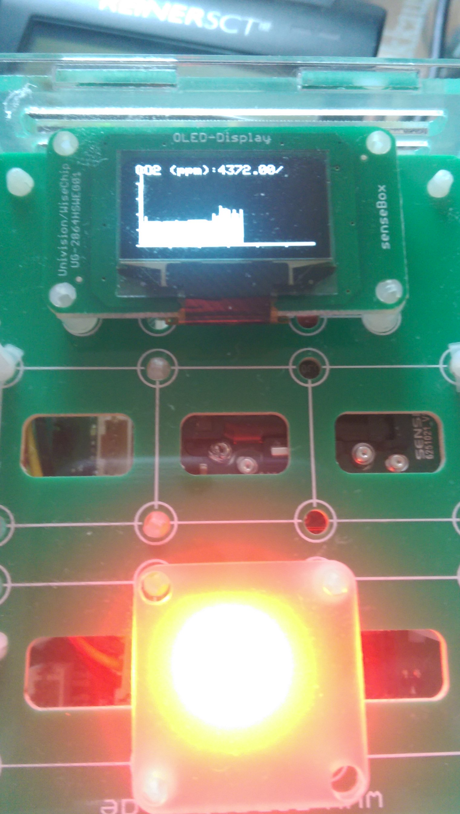

# CO2 Traffic-Ligth for sensebox-co2-ample set

Enhanced CO2 traffic light showing a diagram for last 2h for CO2, temp & humidity measurements.

 

* gyroSwitch: 
    * Switches main measurement if you rotate around Z-axis
    * Shows all mesaurements in dottet diagram with different colors
    * State: mcu's gyro switch implementation is not working atmo.
* accelSwitch: 
    * Switches main measurement if you acclerate in any-direction (only one switch event per 10 sec)
    * Shows the main mesaurements filled, others as line diagram.
    * State: works fine.
* timedSwitch: 
    * Switches diagram every 2 min
    * Ahows selected mesaurements as filled diagram
    * State: works fine :-)

## compile
use a `ln -s ../lib/src/* .` in your sketch dir in front of compilation.